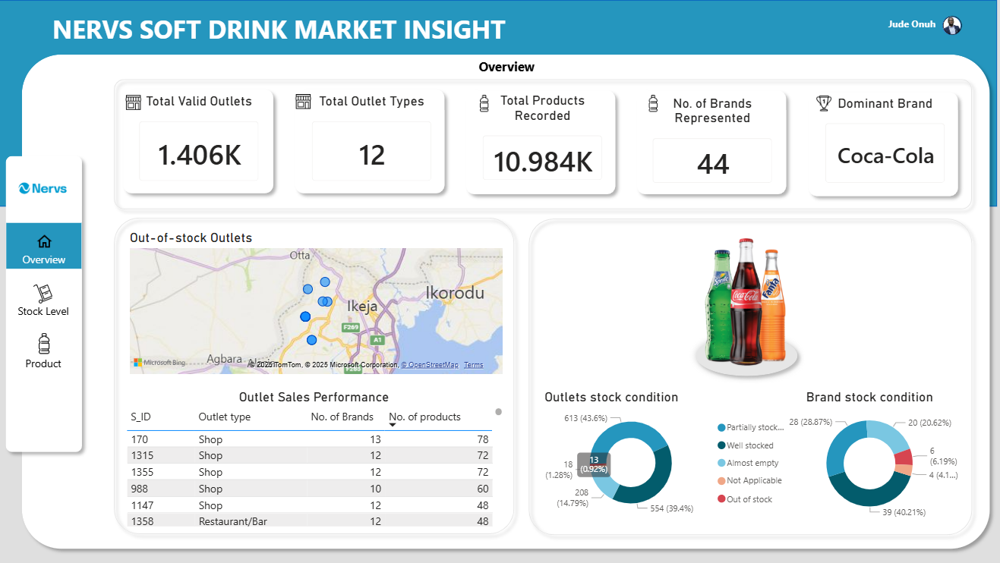
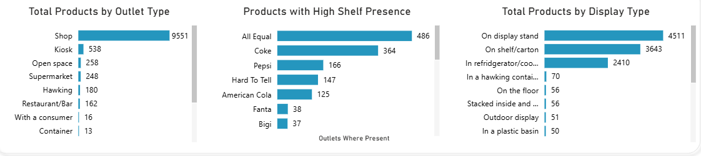

# Soft Drink Market Insight
In a survey of 1,500 outlets across Alimosho LGA, Coca-Cola dominated distribution, shops were the primary sales channel, and over 60% of outlets were partially or fully under-stocked, representing a significant revenue opportunity. This project presents the analysis of the real-world survey data from Alimosho Local Government Area, Lagos, Nigeria.

---

## Aim
The analysis aims to reveal meaningful insights from the data and tell a clear story about soft drink distribution, brand dominance, and consumer trends.

---

## Dashboard
The interactive report for this analysis can be accessed [here](https://app.powerbi.com/view?r=eyJrIjoiNGI2OWUzNGItMTQ3Zi00NzFlLTg5ODctZGJiODJlMDQ4ZGQ0IiwidCI6IjJjYzg3ZmM4LTY5NDQtNDUzMC1hNThlLTFjMDY0MTE4NTYzMCJ9).  

  

---

## 📁 Table of Contents
- [Aim](#aim)
- [Dashboard](#dashboard)
- [Data Overview](#data-overview)  
- [Skills Demonstrated](#skills-demonstrated)  
- [Methodology](#methodology)  
- [Data Cleaning](#data-cleaning)  
- [Key Findings and Recommendations](#key-findings-and-recommendations)  
- [Conclusion](#conclusion)  

---

## Data Overview
- **Source:** The dataset can be accessed [here](data/Product_Visibility_Challenge_Data.csv)
- Raw data has the following columns:
  1. Outlet Name and Type (e.g., supermarkets, kiosks, restaurants, shops)
  2. Coordinates of Outlet (Latitude and Longitude)
  3. Product Type(e.g., Coca-Cola, Pepsi, Bigi, etc.)
  4. Product Display Type (e.g On shelf/carton in refrigerator/cooler, etc.)
  5. Package Type (e.g., PET bottle, can, glass)
  6. Product Shelf Presence
  7. Stock Condition
- Data Shape (1500, 38) | Data format: Comma Delimited (.csv)  

---

## Skills Demonstrated
- Power BI  
- DAX  
- Power Query
- Survey data analysis
- FMCG market analysis
- Data cleaning  

---

## Methodology
- Datasets were imported into and cleaned in Microsoft Power BI as detailed in [Data Cleaning](#data-cleaning).
- Write DAX measures to calculate each of the following:
  * Dominant Brand
  * Total Brands
  * Total products
- Analysis was grouped into three pages on the dashboard: Overview, Stock level analysis, and Product analysis.

---

## Data Cleaning  
- Trimmed all columns
- Split columns into tables: Shops, Products, Stock level, Display type, etc.
- Standardised all column entries, e.g., change 'Fantai' to 'Fanta'; 'Coke', 'Coca cola', and 'Coca Cola' to 'Coca-cola'
- Removed invalid entries, as there are very few.
- Used modelling to connect all tables.
---

## Key Findings and Recommendations
### 1. Coca-Cola was the Dominant Brand
* Coca-Cola recorded the highest distribution presence and sales volume across all surveyed outlets, outperforming competitors such as Pepsi, Bigi, 7Up, etc.
* This observation may be due to the following:
    - Strong distribution network and logistics capabilities.
    - High brand loyalty built from decades of marketing and sponsorship
    - Price flexibility.
* My findings also suggest that retailers may prioritise stocking Coca-Cola to drive revenue and attract customers.
* Smaller brands may face difficulty gaining shelf space or negotiating pricing.

**Recommendations:**
* Competing brands should improve brand visibility through promotions, pricing, and community events.
* Launch targeted campaigns where Coca-Cola's dominance is lowest.

### 2. Shops Sold the Highest Number of Products
* Among outlet types (shops, restaurants, kiosks, supermarkets, etc.), shops recorded the highest product sale frequency. This suggests shops are the most profitable outlet channel for distribution optimisation and marketing focus.
* A possible reason for the above observation may be that shops offer accessibility within local communities, unlike supermarkets or restaurants located in premium or destination areas.

**Recommendations:**
* Prioritise shops in distribution planning and promotional campaigns.
* Implement loyalty programs for shop owners.
* Improve promotional displays within shops.

### 3. Stock Availability in Outlets: 39.4% Well Stocked, 43.6% Partially Stocked, 0.92% Out of Stock
* More than half of outlets do not have full product availability. This is possibly due to logistic delays, poor stock forecasting, or unequal product distribution.
* Low product availability can lead to revenue losses due to unmet demand

**Recommendations:**
* Introduce automated demand forecasting in outlets
* Improve route planning and delivery frequency where possible
* Create vendor performance metrics to track availability by location

### 4. Stock Condition by Brand: 40.2% Fully Stocked, 28.8% Partially Stocked, 6.2% Out of Stock.
* While most brands remain well distributed, certain brands face stock-outs and uneven distribution. This guides strategic resource allocation and identifies distribution gaps.

**Recommendations:**
* Increase delivery frequency for weaker brands
* Develop minimum stock level agreements with distributors

### 5. PET Bottles Were the Predominant Packaging Type
PET bottles (50cl/1L) are the most widely distributed packaging style, suggesting that convenience and portability drive consumer preference. Also, they seem to be safer and easier to store in small shops

**Recommendations**
* Introduce PET-based promotional bundles
* Partner with recycling initiatives for sustainability branding

### 6. Viju, Fanta, and Smoov Were the Least Sold Drinks
* This shows weak market positioning and identifies opportunities or risk points.
* By implication, this could lead to reduced shelf space allocation and reduced orders.
* Low product visibility may be due to:
    - Weaker marketing campaigns
    - Narrower consumer audience (e.g., Viju milk targeted age groups)
    - Packaging or pricing issues

**Recommendations**
* Targeted promo campaigns, sampling, or bundle pricing
* Improve visibility with branded displays

### 7. Most Out-of-Stock Products Used Glass Bottle Packaging
* Higher stock-outs exist among glass-bottled beverages.
* This observation suggests:
  - Inefficient transportation leading to breakage
  - Higher storage and return logistics costs
  - Possible packaging-based supply chain constraints

**Recommendations**
* Increase PET alternatives for high-demand SKUs
* Optimise reverse logistics for glass packaging

---

### 8. Perceived Shelf-Life: Coca-Cola & Pepsi Highest; Maltina, Pop, Pop Cola Lowest
* Most shop owners believe Coca-Cola (364) and Pepsi (166) have the highest shelf-life
* Perception influences purchasing decisions and stocking confidence.
* Products with perceived short shelf-life face reduced stocking volume.

**Recommendations**
* Improve packaging materials and labelling
* Educate retailers using shelf-life training brochures

### 9. Display Stands & Shelves/Cartons Were the Most Preferred Display Methods
* Retailers prefer structured product presentation for visibility, probably due to their more organised and visually appealing layout, allowing for more space optimisation
* In-store visibility influences impulse purchase rate.
* The preference for display stands suggests that manufacturers could invest in branded display stands.

**Recommendations**
* Provide branded display stands to high-performing outlets

## Conclusion
The soft drink market analysis in Lagos reveals that Coca-Cola is the dominant brand, benefiting from stronger distribution, visibility, and consumer trust. Shops serve as the primary sales channel, highlighting the importance of neighbourhood retail outlets over larger supermarkets. Some brands like Viju, Fanta, and Smoov show low performance, possibly due to weaker distribution or reduced customer preference. While consumer perception strongly favours Coca-Cola and Pepsi for longer shelf life, display stands and shelves play a critical role in sales visibility. Overall, the results emphasise the need for better supply chain management, targeted retail partnerships, improved product visibility, and strategic packaging decisions to optimise availability, satisfy consumers, and strengthen market competitiveness in Lagos State.
